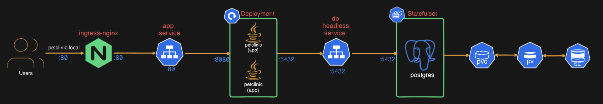

# 🐾 Spring Petclinic on Local Kubernetes

This project demonstrates deploying the [Spring Petclinic](https://github.com/spring-projects/spring-petclinic/) application on a **local Kubernetes cluster** using **Helm**, **StatefulSet for PostgreSQL**, and **Sealed Secrets** for secure secret management.

---
## 🔁 data workflow


---
## 📦 Project Structure

```
.
├── deploy.sh                  # Script to automate deployment
├── sealed-secret.yaml         # Sealed Kubernetes secret (encrypted)
├── db-password.txt            # Plaintext DB credentials (ignored from Git)
└── spring-petclinic/          # Helm chart for Petclinic + PostgreSQL
    ├── Chart.yaml             # Helm metadata
    ├── values.yaml            # Centralized config for all resources
    └── templates/
        ├── app-service.yaml
        ├── configmap.yaml
        ├── db-service.yaml
        ├── db-statefulset.yaml
        ├── deployment.yaml
        └── ingress.yaml
```

---

## 🚀 How to Deploy

> Prerequisites: Docker, Minikube, Helm, Kubectl, Kubeseal, OpenSSL

### 1. Run the deployment script
```bash
chmod +x deploy.sh
./deploy.sh
```

This script will:
- Validate all prerequisites
- Start Minikube and enable ingress
- Install Sealed Secrets controller (via Helm)
- Generate DB credentials and seal them
- Apply the sealed secret
- Deploy PostgreSQL (StatefulSet)
- Deploy the Petclinic app
- Suggest a local domain entry to `/etc/hosts`

---

## 🌐 Access the Application

After deployment, update your `/etc/hosts` file to route traffic to Minikube:

```bash
echo "$(minikube ip) petclinic.local" | sudo tee -a /etc/hosts
```

Then open: [http://petclinic.local](http://petclinic.local)

---

## 🔐 Secrets Management

- The PostgreSQL credentials are generated using `openssl` and sealed with `kubeseal`.
- The `sealed-secret.yaml` is committed safely and decrypted **only by your Kubernetes cluster**.

---

## 🧪 Verification

- PostgreSQL data is stored via a `StatefulSet` with persistent volumes.
- Petclinic app connects using environment variables and ConfigMap settings.
- Use `psql` in the `demo-db-0` pod to verify data:

```bash
kubectl exec -it demo-db-0 -- psql -U user -d petclinic
```

---

## 🧹 Clean Up

```bash
minikube delete
```

---

## 📁 Notes

- This setup uses **1 replica** of PostgreSQL to ensure data consistency.
- `sealed-secret.yaml`, `.env`, and other sensitive files should be Git-safe (see `.gitignore`).
- Helm values can be customized via `spring-petclinic/values.yaml`.


